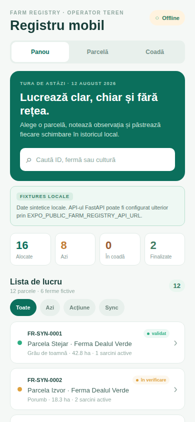

# Farm Registry Mobile — teren, sarcini și observații offline

Aplicație mobilă pentru operatori de teren: verificarea parcelelor, sarcini, observații și lucru fără conexiune. Interfața este construită în Expo / React Native, Romanian-first și mobile-first, cu un flux local complet pentru lucru, coadă offline și istoric.

[Deschide demo-ul Expo Web →](https://farm-registry-mobile.vercel.app)



## Flux de lucru

Operatorul caută o parcelă, deschide fișa, adaugă o observație sau creează o sarcină, apoi urmărește starea în outbox și în auditul local. Filtrele pentru azi, acțiune și sincronizare reduc lista la lucrările care cer atenție.

## Ce include

- Dashboard de tură cu sarcini, termene, acțiuni din coadă și sarcini finalizate.
- Căutare și filtre după fermă, parcelă, cultură și starea de lucru.
- Fișă de parcelă cu cultură, suprafață, status, operator, sarcini și observații.
- Creare și actualizare locală de sarcini, plus observații validate înainte de salvare.
- Jurnal de audit local pentru acțiunile efectuate în aplicație.

Datasetul demonstrativ conține **6 ferme fictive** și **12 parcele fictive**. Numele, identificatorii `FR-SYN-*`, localitățile, suprafețele, sarcinile, observațiile și metadatele foto sunt sintetice.

## Offline și modelul local

`AsyncStorage` păstrează local sarcinile, observațiile, auditul și outbox-ul între reîncărcări. Observațiile și schimbările de sarcini au `client_action_id`; coada previne duplicatele și modelează stările `pending`, `synced` și `failed`, inclusiv retry și eșec simulat.

Butonul Offline / Online controlează rularea flush-ului demonstrativ. Important: acest „sync” rulează numai adaptorul local și actualizează starea/auditul local; nu transmite date către un server și nu oferă sincronizare de producție sau backend persistent.

## Limita API-ului și a datelor

Există o graniță HTTP opțională în `src/apiClient.ts`, configurabilă prin `EXPO_PUBLIC_FARM_REGISTRY_API_URL`. UI-ul vizibil nu o folosește: rămâne pe fixtures sintetice și fluxul offline local, chiar dacă este configurat un endpoint.

Aplicația Mobile **nu este conectată la API-ul Render**. [Farm Registry API – documentație](https://farm-registry-api-demo.onrender.com/docs) este un backend separat, nu sursa de date a demo-ului mobil.

Nu există integrări reale, sincronizare pe server sau afirmație de pregătire pentru producție. Folosește numai date sintetice/publice în acest demo; o aplicație reală ar necesita separat autentificare, autorizare, protecția datelor, persistență și audit de securitate.

## Stack

- Expo 52, React 18 și React Native 0.76
- TypeScript 5.6
- React Native Web / React DOM pentru preview-ul web
- `@react-native-async-storage/async-storage` pentru starea locală

## Dovezi / Evidence

[Arhitectură și matrice de dovezi verificabile →](docs/evidence-matrix.md)

## Rulare locală și export

```bash
npm ci
npm start
```

```bash
npm run android    # țintă Android prin Expo
npm run ios        # țintă iOS prin Expo
npm run typecheck  # verificare TypeScript
npm test           # teste Node pentru logica locală
npm run export:web # export static Expo Web
```

## Proiecte asociate

- [Farm Registry Web](https://github.com/luciandanileico94-dev/farm-registry-web) — client web separat.
- [Farm Registry Python Tools](https://github.com/luciandanileico94-dev/farm-registry-python-tools) — backend FastAPI demonstrativ și contracte HTTP asociate.
